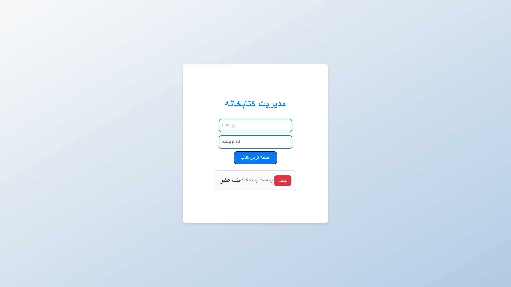

# Markdown Previewer

## Description

The Markdown Previewer is a React application that allows users to enter Markdown text into a textarea and see a live preview of the rendered HTML output. The app uses the `marked` library to convert Markdown to HTML and provides a smooth, real-time editing experience.

## Features

- **Live Markdown Preview:** As users type Markdown into the textarea, the preview updates in real-time.
- **Default Markdown Content:** When the app first loads, it displays a sample Markdown content that includes various elements such as headings, lists, code blocks, and more.
- **Markdown to HTML Rendering:** The app uses the `marked` library to convert Markdown text to HTML.

## Demo 📸


## Technologies Used

- **React**: A JavaScript library for building user interfaces.
- **marked**: A library for parsing Markdown and converting it to HTML.
- **CSS**: For styling the application.

## Installation

1. Clone the repository:

    ```bash
    git clone git@github.com:latifa-wakili/Markdown-Previewer-.git
    ```

2. Navigate to the project directory:

    ```bash
    cd markdown-previewer
    ```

3. Install the dependencies:

    ```bash
    npm install
    ```

## Usage

1. Start the development server:

    ```bash
    npm start
    ```

2. Open your browser and navigate to `http://localhost:3000` to view the application.

## File Structure

- `public/index.html`: The HTML template for the app.
- `src/index.js`: The entry point for the React application.
- `src/App.js`: The main component that handles the Markdown preview functionality.
- `src/index.css`: The CSS file for styling the application.

## User Stories

1. **Text Area Element**: The application includes a `<textarea>` element with `id="editor"`.
2. **Preview Element**: The application includes a `<div>` element with `id="preview"`.
3. **Real-Time Preview**: The content of the `#preview` element updates as you type in the `#editor` element.
4. **Markdown to HTML**: The `#editor` content is converted to HTML and rendered in the `#preview` element.
5. **Default Markdown Content**: The `#editor` field contains default Markdown that includes headings, links, code blocks, lists, and more.
6. **Initial HTML Rendering**: The default Markdown is rendered as HTML in the `#preview` element when the app loads.

## Optional Bonus

- The application interprets carriage returns and renders them as `<br>` (line break) elements.

## Contributing

1. Fork the repository.
2. Create a new branch (`git checkout -b feature-branch`).
3. Make your changes.
4. Commit your changes (`git commit -am 'Add new feature'`).
5. Push to the branch (`git push origin feature-branch`).
6. Create a new Pull Request.

## Author 👩‍💻
- Twitter: [@Latifa_Wakili](https://x.com/WakiliLatifa?t=wlHTh8JuyFprQsN_hZQGWQ&s=08)
- LinkedIn: [Latifa Wakili](https://www.linkedin.com/in/latifa-wakili-68423b277?utm_source=share&utm_campaign=share_via&utm_content=profile&utm_medium=android_app)
- Email: [Latifa Wakili](saavenwakili@gmail.com)


## License

This project is licensed under the MIT License. See the [LICENSE](LICENSE) file for details.

## Acknowledgments

- Inspired by FreeCodeCamp's Markdown Previewer challenge.
- Thanks to the contributors of the `marked` library.

